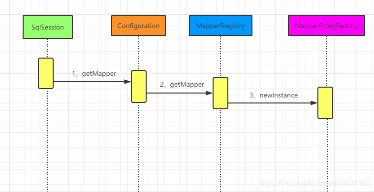
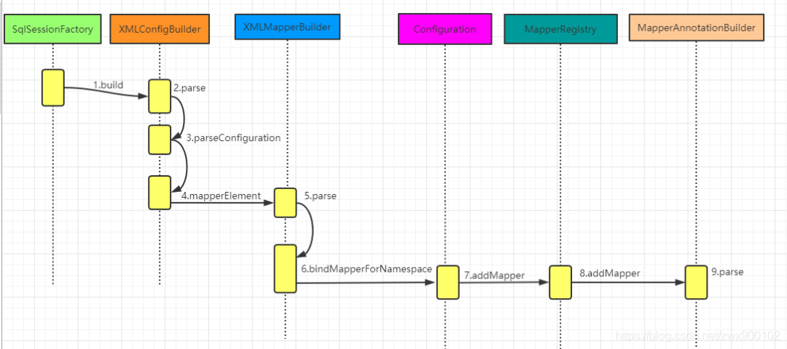
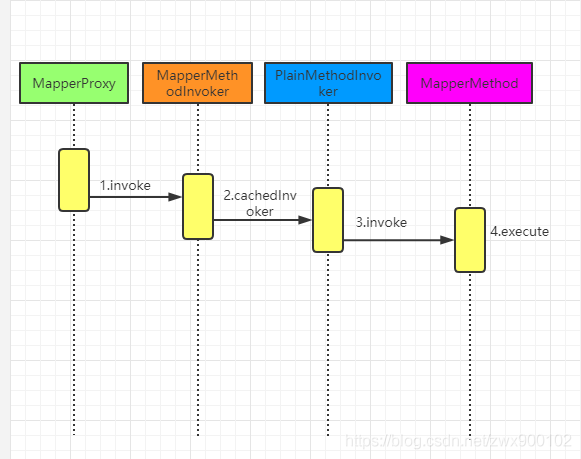
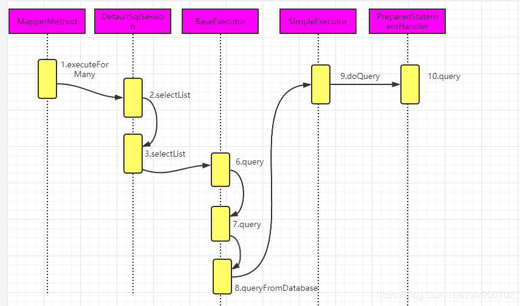
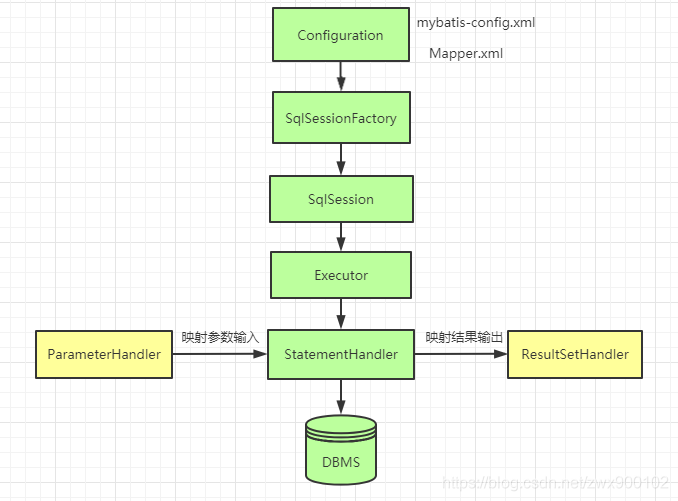

### 获取Mapper接口

#### 调用session.getMapper方法之后的运行时序图：

最终通过JDK动态代理，调用org.apache.ibatis.binding.MapperProxy#invoke

#### Mapper接口及其映射文件是在加载mybatis-config配置文件的时候存储进去的

### sql执行流程分析

获取到的Mapper接口实际上被包装成为了代理对象，所以我们执行查询语句肯定是执行的代理对象方法，接下来我们就以Mapper接口的代理对象MapperProxy来分析一下查询流程。

#### 寻找sql

#### 执行sql语句

